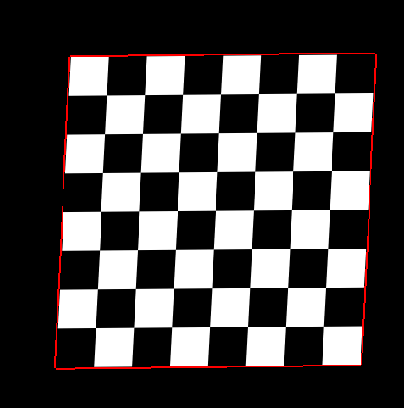

Matlab algorithm which determines boundaries of chessboard on black background

Idea is that I search line equation from 4 boundaries and find corner as interception of two lines. It gives a result

**Example of algorithm work:**

 

